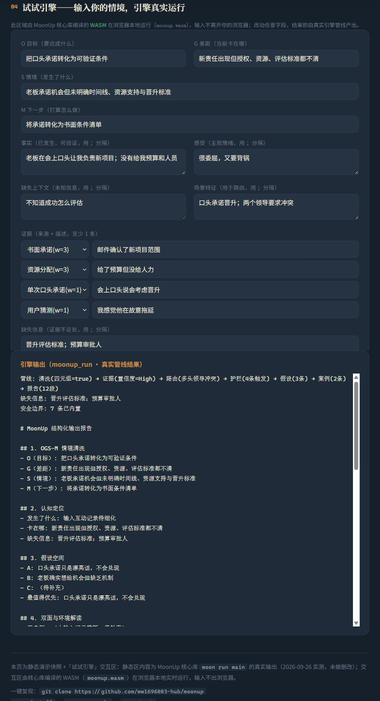

# MoonUp：MoonBit 确定性规则引擎库

面向决策类应用的结构化推理规则引擎，使用 [MoonBit](https://www.moonbitlang.com/) 实现。
**规则即数据**：使用者定义规则集（条件→动作），引擎确定性执行；本仓库自带一组「结构化记录 → 决策报告」预置规则包与推理组件（证据分级/防偏见/场景路由/假设/案例），可直接使用或替换。

> 2026 MoonBit 黑客松参赛项目 · 九月赛 · [MIT 许可证](LICENSE)
>
> 

## 项目方向与使用场景

**方向**：规则引擎库 × 预置规则包。核心是把"结构化记录 → 证据分级 → 防偏见检查 → 决策报告"沉淀为确定性、可测试、可嵌入的 MoonBit 规则引擎；规则（Rule）以 DSL 表达、可注入，引擎执行与规则内容解耦。自然语言理解留在外层应用，核心判断逻辑保持可复现。

**通用性说明**：`engine` 为通用规则引擎核心（Rule/Fact/RuleEngine），不绑定任何业务语义；`evidence`/`guardrail`/`hypothesis`/`case` 是可组合的推理组件，任一需要把隐性判断显性化的场景（客户分层、客服分流、销售跟进、审核决策、向上管理）均可复用同一套组件与案例沉淀机制。

**预期使用场景**：

1. **规则化业务决策（风控/营销/客服）**：业务把分层规则写成 Rule DSL 注入引擎，对用户事实执行分层/分流/评分，结果确定、可审计——如 `intent~=高 && region==华东 → tier=高价值`。
2. **决策类应用嵌入**：任何需要"基于证据下判断"的应用（销售跟进、客服定责、面试复盘）可嵌入 evidence/guardrail/hypothesis/case 组件，把隐性判断显性化。
3. **预置规则包（向上管理示例）**：仓库自带 16 类场景规则包作为首个示例，展示"机制复用、内容自备"——使用者可通过 `with_config` 注入自己的场景规则集。

## 演示预览



## 是什么

**MoonUp** 是 MoonBit 生态的确定性规则引擎库：`engine` 提供规则即数据的核心（条件 DSL `==`/`!=`/`~=` 与 `&&`、动作 `=`/`+=`、优先级冲突消解、确定性执行）；`evidence`/`guardrail`/`hypothesis`/`case`/`scenario` 构成一组可组合的推理组件与预置规则包。对标 Java Drools / JS json-rules-engine：为 MoonBit 生态补上"规则引擎"这一标准件位置。

**解决什么问题**：业务规则（客户分层、客服分流、审核判定、承诺与证据的置信度判断）散落在代码与个人经验里，不可测试、不可审计。MoonUp 把规则数据化、执行确定性，让"判断"可测试、可复现、可沉淀。

## 模块（全部完成，101 个单元测试通过）

| 模块 | 能力 |
|------|------|
| `engine` | 通用规则引擎核心（本轮新增）：Rule（条件 DSL `==`/`!=`/`~=` 与 `&&` 连接）+ Fact（键值事实）+ RuleEngine（匹配/执行/优先级冲突消解）+ 追加式标签累积；8 个单元测试 |
| `ogsm` | OGS-M 情境清洗：目标/差距/情境/下一步四元组 + 事实分离 + fight/flight 漂移检测 |
| `evidence` | 证据分级组件（书面/资源/结果=高，措辞/反馈=中，单次口头/猜测=低）+ 事实/推断/假设三分离 + 置信度合成 + 低置信度强制验证动作 |
| `scenario` | 配置驱动的场景路由（默认 16 类示例规则包，`with_config` 可注入自定义规则集）+ top2 命中 + 路由规则提示 |
| `guardrail` | 防偏见组件：8 类认知/叙述偏差护栏（转述放大/措辞行为矛盾/文化语义/过度共情/疲惫/希望扭曲…）+ 5 项必查 |
| `hypothesis` | 假设空间组件：2-4 假设生成 + 验证动作 + 最值得优先判定 |
| `case` | 案例沉淀组件：案例卡片标签检索 + 迁移原则 + 不匹配点提示；落盘（save_json/load_json）+ 反馈闭环（feedback）+ 修正处理（supersede）+ 命中计数 → 机制候选 |
| `output` | 12 段决策报告模板 + Safety Boundaries 7 条安全边界 |

## 验收标准对照（2026 MoonBit 黑客松）

| 验收标准 | 状态 | 证据位置 |
|---|---|---|
| 01 MoonBit 为主要实现语言 | ✅ | 全仓库 MoonBit 实现：`lib/` 7 个模块 + `main/` + `tools/`，无其他语言 |
| 02 仓库公开，保留连续可追踪的提交与开发记录 | ✅ | 本仓库持续提交；PR/commit 记录见 GitHub；冲刺计划见 Issues #10–#13 |
| 03 提供清晰 README、可运行示例与必要测试 | ✅ | 本 README；一键复现与真实输出见 [docs/DEMO.md](docs/DEMO.md)；101 个单元测试 `moon test` |
| 04 已有项目包含本期实质新增 | ✅ | 全部代码为本期（2026-09）从零实现；`engine` 通用规则引擎层 + 7 模块组件 + 案例沉淀机制均为本期新增 |
| 05 开源合规：使用认可许可证，说明移植/参考来源 | ✅ | MIT 许可证；推理规则来源见「素材来源」章节 |
| 06 AI 可解释：目标、路径与质量由参赛者掌握 | ✅ | 见「AI 使用说明」章节 |

## 输入模板（结构化记录）

引擎输入为结构化记录，字段与各模块 API 一一对应（示例取自 `main/main.mbt` 真实调用）：

```moon
// OGS-M 四元组 + 事实/感受分离
let sep = @ogsm.FactSeparation::new()
sep.facts.push("老板在会上口头让我负责新项目")   // 事实：已发生、可验证
sep.feelings.push("很委屈，又要背锅")             // 感受：主观情绪
sep.missing_context.push("不知道成功怎么评估")   // 缺失上下文 → 报告标注「待补充」

let ogsm = @ogsm.Ogsm::new(
  "把口头承诺转化为可验证条件",                  // O 目标
  "新责任出现但授权、资源、评估标准都不清",      // G 差距
  "老板承诺机会但未明确时间线、资源支持与晋升标准", // S 情境
  "将承诺转化为书面条件清单",                    // M 下一步
)

// 证据分级：4 种来源，权重内置
// 书面承诺 w=3 · 资源分配 w=3 · 单次口头承诺 w=1 · 用户猜测 w=1
let items = [
  @evidence.EvidenceItem::new(@evidence.WrittenCommitment, "邮件确认了新项目范围"),
  @evidence.EvidenceItem::new(@evidence.ResourceAllocation, "给了预算但没给人力"),
]
ev.assess(items, ["晋升评估标准", "预算审批人"])  // 缺失项 → 不编造，进入「待补充」
```

**约束**：键值缺失 → 输出对应段标注「待补充」，绝不编造结论；同一输入恒得同一输出（确定性）。

## 快速开始

```bash
moon run main              # 端到端 Demo：7 段分模块演示 + MVP 单情境全链路
moon test                  # 101 个单元测试
moon run tools/export_cases > cases/cases.json   # 导出案例库落盘示例（纯 JSON）
```

## 网页演示

> [MoonUp 交互演示页（GitHub Pages 在线版）](https://mw1696803-hub.github.io/moonup/moonup-demo.html) — 输入情境 → 点击 7 模块管线查看各步真实输出 → 12 段报告；页面底部「试试引擎」区支持**粘贴原话 → 前端确定性规则解析为 OGSM（无 LLM）→ WASM 在浏览器本地真实运行**（`docs/moonup.wasm`，输入不出浏览器），解析结果可手动微调后再次运行。数据取自 `moon run main` 真实输出（2026-09-26 实测）。源码在 [docs/moonup-demo.html](docs/moonup-demo.html)，WASM 导出入口在 [lib/wasm_api](lib/wasm_api/)，输入协议见 [docs/INPUT.md](docs/INPUT.md)。

## MVP 演示（moon run main）

Demo 覆盖：OGS-M 清洗 → 证据分级与置信度 → 场景路由 → 防偏见检查 → 假设空间 → 案例检索 → 12 段结构化报告，并以一个完整情境（口头晋升承诺 + 多头领导）走完全管线。

## 架构

```
规则引擎核心（lib/engine）：Rule（条件 DSL）→ Fact（键值事实）→ RuleEngine（确定性执行 + 冲突消解）
  ↓ 组合（推理组件可独立复用）
ogsm（清洗四元组 + 事实分离）→ evidence（证据分级 + 置信度）
  → scenario（配置驱动场景路由）→ guardrail（防偏见检查）
  → hypothesis（假设空间）→ case（案例参考）→ output（12 段报告）
```

## 案例沉淀（case 生长口子）

- **落盘数据层**：`save_json()` / `load_json()` 将案例库整体序列化/反序列化（MoonBit core 无文件 IO，宿主负责真实文件读写；损坏/旧版格式返回 Err 不崩溃）。落盘示例见 [`cases/cases.json`](cases/cases.json)（25 条，含 verified/superseded/hit_count 真实沉淀状态）。
- **反馈闭环**：`record_feedback(card_id, positive|negative)` —— 正反馈 → `verified`，负反馈 → `superseded`（修正优先，不覆盖不删除）。
- **命中计数**：`search` 命中自动 `hit_count +1`，跨会话通过落盘累计。
- **机制候选雏形**：`mechanism_candidates(min_hits)` 返回「命中 ≥ 阈值 且 已验证」的案例，供人工确认固化为适合用户自身的机制；多场景重复反馈（≥2-3 个不同场景）后才升级为规则。

## 素材来源

规则引擎 DSL 与冲突消解为通用设计（对标 Drools / json-rules-engine 的规则模式）；预置规则包（16 类场景、证据权重、防偏见护栏）的方法论来源于自研 upward-management-coach AI Skill（21 个 references + 案例库），本项目将其确定性规则引擎化为 MoonBit 实现。全部代码原创，采用 MIT 许可证。

## AI 使用说明

本项目在开发过程中使用了 AI 辅助编程工具（代码生成与文档助手），符合赛事「AI 可解释」要求。AI 参与范围与人工责任如下：

**AI 辅助的范围**
- 代码生成：MoonBit 模块的脚手架与部分函数实现（数据结构、检索逻辑、序列化等）
- 接口设计辅助：模块间 API 草拟与调整建议
- 测试用例：边界场景测试的生成与补全
- 文档：README、设计文档与申报材料的起草、润色

**参赛者掌握并负责的部分**
- 架构设计：7 模块管线（ogsm → evidence → scenario → guardrail → hypothesis → case → output）由参赛者设计
- 方法论提炼：推理规则来源于自研 upward-management-coach Skill（21 个 references），规则抽取与来源权重映射由参赛者完成
- 技术选型：选择 MoonBit 与确定性规则引擎
- 代码审查与测试验证：所有 AI 生成代码经参赛者逐条审查，101 个单元测试与端到端 Demo 由参赛者验证通过

**关键技术选择的理由（为什么用确定性规则引擎，而非 LLM 直接输出）**
- **可测试**：每条推理路径可被单元测试覆盖（101 个测试）
- **无幻觉**：不生成规则之外的判断，证据不足时强制输出"验证动作"而非编造结论
- **可审计**：证据分级、置信度、假设生成全部可追溯，同一输入恒得到同一输出
- **可嵌入**：纯 MoonBit 核心库，可被 CLI、Web、IM 机器人等任意形态应用嵌入

LLM 的角色：本项目将自然语言理解留在外层（外层应用把原始对话清洗为结构化输入），不在本仓库范围内；核心判断逻辑保持确定性，确保结果可复现、可审计。
